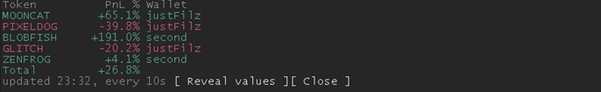
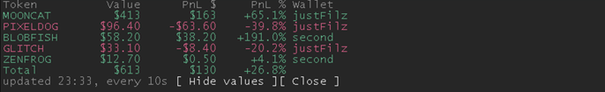

# pumpfun-utilities

Two things for people who trade on pump.fun and use Claude Code.

A pane that shows your open positions and how much each is up or down, and opens by itself while Claude is working on something else. And a markdown trade journal that fills itself from on-chain data, with a skill that teaches Claude to help you keep it honest.

It is read-only. It uses your public wallet address, no private key, and it cannot sign, send or sell anything. There are no sell buttons and there will not be.

## What you get

`/positions` opens the pane. It also opens on its own when a turn runs longer than 10 seconds, and closes when the turn ends. A header names the columns: Token, Value, PnL $, PnL %, Wallet. Each row is a position on any chain pump.fun tracks, with its unrealized profit or loss against your cost basis, in green or red, and the wallet it sits in. A total closes the list. Dollar values are hidden until you press Reveal, so a screen share shows percentages only. It refreshes while it is open.

`/journal` checks your wallet against the journal and prints what is new, what disagrees, and what is open. `/journal write` appends the new closed trades to this month's file, rebuilds an open-positions snapshot and saves the threads under your own callouts. `/journal write 7` looks back 7 days instead of 30.

The `pumpfun-journal` skill is what Claude follows while you do this. The main rule: it never invents a thesis, an outcome or a mistake. Those lines stay `not recorded` until you say something.





These are demo positions (`demo` setting, or `PUMPFUN_DEMO=1 claude`): made up, no wallet needed. A first look takes one command.

## Install

You need Claude Code 2.1.287 or later (the version that introduced mods) and Python 3.

```
claude plugin marketplace add KamiFin/pumpfun-utilities
claude plugin install pumpfun-utilities@pumpfun-utilities
claude plugin configure pumpfun-utilities@pumpfun-utilities
```

Then start a new session. If the pane never appears, mods may be switched off for installed plugins in your account's rollout. Setting `CLAUDE_CODE_ENABLE_FUNCTION_HOOKS=1` in the `env` block of `~/.claude/settings.json` turns them on.

## Settings

Nothing is hardcoded. Everything personal is a plugin setting, filled in with `claude plugin configure` or `/config`.

| Setting | Required | What it is |
|---|---|---|
| `wallet` | yes, unless demo | Your main wallet address. Public, read-only. |
| `demo` | no | Show made-up positions in the pane, with no wallet and no network call. For a first look or a screenshot that shows nothing personal. |
| `mainLabel` | no | The name shown for your main wallet in the Wallet column, for example your pump.fun username. Default `main`. |
| `extraWallets` | no | Other wallets as `label=address,label=address`. |
| `journalDir` | no | Folder for the journal. Empty means `~/pumpfun-journal`. Point it at an Obsidian vault if you like. |
| `heliusKey` | no | A Helius API key, only for the rewards section of `/journal`. Marked sensitive, so it goes to secure storage, not `settings.json`. |
| `refreshSeconds` | no | Pane refresh, default 30. Below about 20 pump.fun starts answering 429. |
| `minSeconds` | no | How long a turn runs before the pane opens, default 10. |
| `minUsd` | no | Hide positions worth less than this, default 2. |

The script also runs on its own, outside Claude Code, with the same settings as environment variables: `PUMPFUN_WALLET`, `PUMPFUN_EXTRA_WALLETS`, `PUMPFUN_JOURNAL_DIR`, `PUMPFUN_HELIUS_KEY`.

```
PUMPFUN_WALLET=<address> python3 scripts/pumpfun_journal.py           # dry run
PUMPFUN_WALLET=<address> python3 scripts/pumpfun_journal.py --write   # append new trades
```

## The journal

One markdown file per month, one block per closed position, identified by `ca: <mint>`. It is append-only: the script never edits a block you or Claude wrote. A block looks like this:

```
## 2026-10-03 EXAMPLE "Example Coin" (Solana, pump.fun) [CLOSED, auto-populated: 2 buy(s), 1 sell(s)]
ca: <mint>
source: pump.fun trades API, auto-populated by pumpfun_journal.py, not manually verified
size: $150.22
entry: $41.2K mc
exit: $38.9K mc
pnl: $-13.72 (-9.1%)
thesis: not recorded
outcome: not recorded
mistake: not recorded
```

Entry and exit are rebuilt from the on-chain buy and sell legs, not from the API's own aggregate, which hides rebuys. Rewards and airdrops are reported separately and never mixed into trade profit. `skills/pumpfun-journal/patterns-template.md` is a starting point for a rules file you can check open positions against.

## Things to know

The data comes from pump.fun's frontend API. It is public and needs no key, but it is not documented, can change without notice and rate-limits you. If it breaks, this breaks. Check pump.fun's terms of use before you rely on it.

A Claude Code mod runs with the same access Claude Code has on your machine. Read the source before you load one. This one is a few hundred lines, makes requests only to pump.fun and, if you set a key, Helius, and writes only to your journal folder.

This is a journal and a viewer, not advice. Nothing here tells you what to buy or sell.

## Development

```
claude plugin validate .
claude plugin test .
python3 -m unittest discover -s tests
```

The mod is in `hooks/`, the journal script in `scripts/`, the skill in `skills/`. Contributions that keep it read-only are welcome.

## Licence

MIT.
